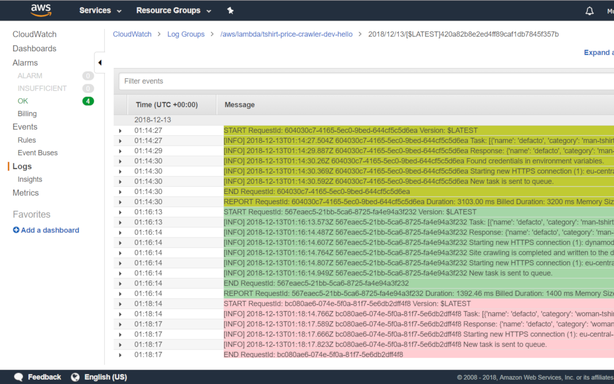
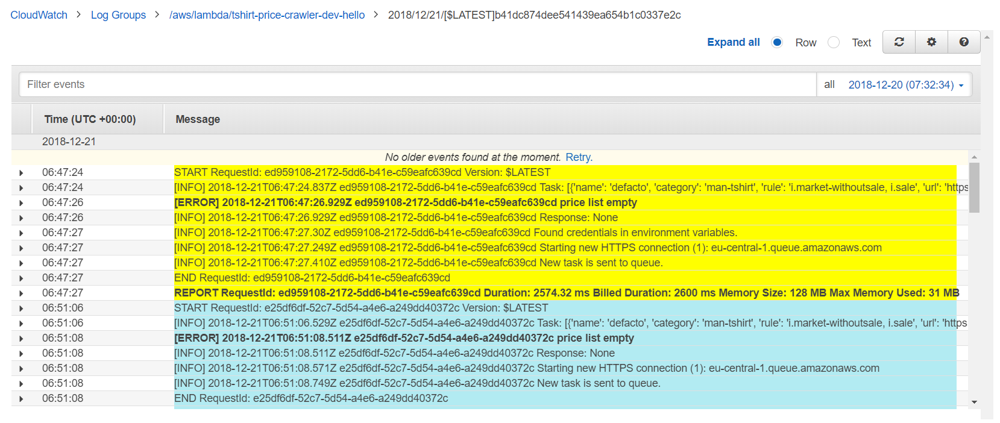
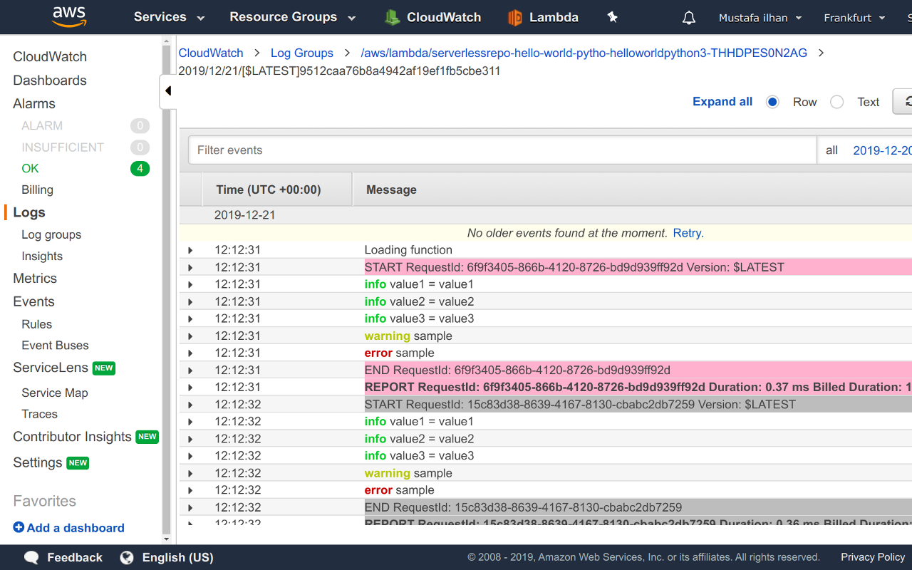
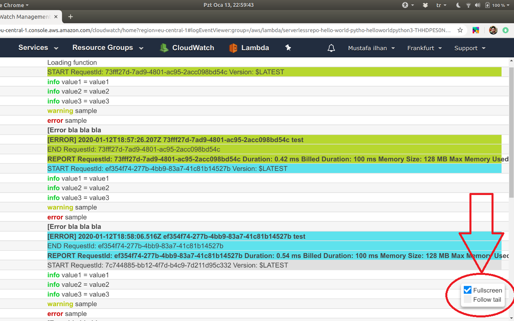

Colorize CloudWatch Logs
========================

This is a Google Chrome extension. You can install this extension by this address: [Chrome Web Store](https://chrome.google.com/webstore/detail/colorize-cloudwatch-logs/fkagnmcbeokmapmcbecbcmpccmlbhkpl).

The purpose of this extension is to group logs visually on AWS CloudWatch. There are three rules:
- Set a different background color for each log group of AWS Lambda invocation. Therefore, you can easily recognize beginning, body and end of the logs of the same invocation.

- Set font wieght of lines having `REPORT`, `[ERROR]` and `[Error ` keywords to bold.

- Set color of ANSI terminal codes in the logs. (by [@oguimbal](https://github.com/oguimbal))

Further, there is two functionality for better log viewing experience (by [@oguimbal](https://github.com/oguimbal)):
- Switching to fullscreen,
- Refreshing the logs periodically to load new items.

This extension doesn't collect any user and web page information. It only runs on AWS CloudWatch Logs web page. It is free to use.

Overhead is very low, colorize operation takes ~7 milliseconds, listen operation for new event logs takes just ~0.5 milliseconds in every second.

### Contributions
Contributions are welcome. Please follow the standart.js convention if you want to contribute.

### Contributors
- [@oguimbal](https://github.com/oguimbal)
- [@svikrant2014](https://github.com/svikrant2014)
- [@ktwbc](https://github.com/ktwbc)

### Open Source
- [ansi_up.js](http://github.com/drudru/ansi_up)